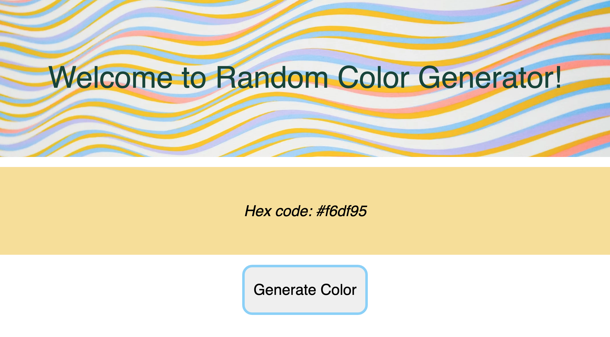

# Random color generator :rainbow:

This React web application allows the user to create a random hex color.

## Netlify link

https://admiring-mestorf-0d0696.netlify.app

## CodeSandbox Link

https://codesandbox.io/s/random-color-generator-react-app-iqpfs?file=/src/index.js

## Screenshot

